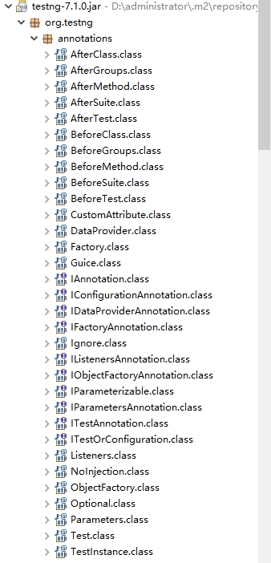

# <center>TestNG学习笔记-2020年4月24日</center>

## 综合

关于testng的学习笔记中设计到的很多观点来自于以下的一本书：


这是一本专门介绍testng的进阶书，涉及到很多平时用不到的知识，当然国内买不到正版，比较可惜。

当然文中多数代码都来自真实实践，少部分代码直接用的书中源码。
**如有版权问题，请联系作者做相关处理，谢谢~~~
转载请注明出处，以免有法律纠纷~~**

## 一、TestNg概览

### 1.1 annotation

TestNG采用注解方式来标注测试类和测试方法，有以下好处:
- 方法名称不再受限，不再局限于某种模式或者格式么，它通过查找注解来确定它的意向方法，而不是通过名称
- 我们可以向注解传递部分参数
- 注解是强类型的，所以编译器可以发现错误，原来通过名称标注的方式则不会
- 测试类不再需要从某个特定类继承

注解清单:
BeforeSuite BeforeTest BeforeClass BeforeMethod BeforeGroup
After...
DataProvider
ExpectedException
Factory
Test
Parameters

具体见下图:


### 1.2测试、套件、配置注解

testng定义了一套术语来描述测试，如下面的程序配置:

```xml

<?xml version="1.0" encoding="UTF-8"?>
<!DOCTYPE suite SYSTEM "http://testng.org/testng-1.0.dtd" >
<suite name="Suite1">
	<test name="test12">
		<classes>
			<class name="TankLearn2.Learn.TestNGLearn1" />
            <class name="TankLearn2.Learn.TestNGLearn2">
                <methods>
                    <include name="includes.*" />
                    <exclude name="excludes"/>
                </methods>
            </class>
		</classes>
	</test>
</suite>
```

上述配置文件告诉我们,TestNG将执行在TestNGLearn1中找到的所有方法，并执行TestNGLearn2中以includes.*开头的所有方法，排除名称为excludes的方法。

下面的程序配置展示了如何制定包:

```xml
<suite name="Suite1">
	<test name="testwithpackage">
		<packages>
			<package name="test.testpackage.tested*" />
		</packages>
	</test>
</suite>
```
则会运行以test.testpackage.tested开头的所有包中找到的方法。

如上所述，该xml文件中记录了一些术语，它们很重要，因为这跟注解息息相关，如下所示：

- suite （套件），由一个或者多个测试(test)组成
- test（测试），由一个或者多个类组成
- class（类），由一个或者多个方法组成

我们所说的注解，多数是指以@Before或者@After开头的这些注解，它们顶一个TestNG生命周期中的事件。
当某些类或者方法被以下注解标注时，它们将在如下时刻运行：

- @Before/@After(Suite) 在某个测试套件开始之前/所有测试方法结束之后
- @Before/@After(Test) 在某个测试开始开始之前/所有测试方法执行之后(注意测试由一个或者多个类组成)
- @Before/@After(Class) 在某个测试类开始之前/某一个测试类的所有测试方法执行之后
- @Before/@After(Method) 在某个测试方法之前/某个测试方法执行之后
- @Before/@After(Group) 在某个组的所有测试方法执行之前/所有测试方法执行之后

### 1.3 分组

你可以自己定义分组的名称和编号，可通过@Test注解来实现。
如下代码所示:

```java
@Test(groups={"fast","unit","database"})
public void rowShouldBeInserterd(){

}

```

定义好分组之后，可以在测试执行时，包含或者排除这些分组，如下程序所示:

```shell
java org.testng.TestNG -groups fast com.example.MyTest

```

### 1.4 关于testng.xml

它以xml方式记录所有测试。它可以清晰在一个文件中描述你的测试套件和需要的参数，可以传到代码库，或者共享给他人。

也可以提取测试子集，或者分成多种阶段来运行比如testng-unit.xml和testng-database.xml，将分别运行单元测试和针对数据库进行的测试等等。

注意它并不是执行testng必须的。