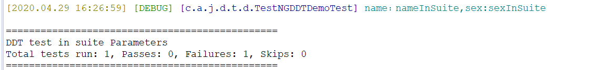
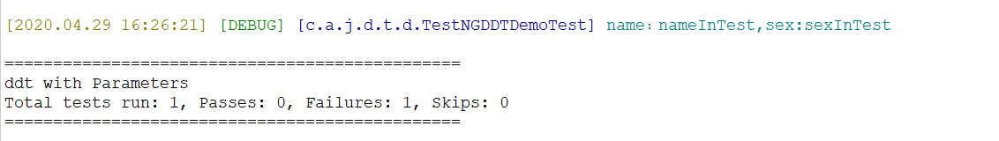

# <center>TestNG学习笔记-测试设计模式-数据驱动测试</center>

## 一、数据驱动测试(DDT)-概览

主要用来解决以下形式的问题:

- 测试需要针对许多具有类似数据结构的数据来执行
- 实际的测试逻辑是一样的，仅仅改变的是数据结构
- 数据可以被一组不同的人修改

它的重点不是被测试的程序代码逻辑，而是这段代码所想要操作的数据。

TestNG可以让你通过两种方式向测试方法传递参数:
- 利用testng.xml
- 利用data providers

## 二、 利用testng.xml传递参数

可以在testng.xml中配置需要传递的参数，用<parameter>标签，可以在suite中声明，也可以在test中声明，如果test中有，则优先使用test中定义的，如果没有则会往上找。

```xml
<?xml version="1.0" encoding="UTF-8"?>
<!DOCTYPE suite SYSTEM "https://testng.org/testng-1.0.dtd">
<suite name="ddt with Parameters">
	<test thread-count="5" name="Test">
		<parameter name="name" value="nameInTest"></parameter>
		<parameter name="sex" value="sexInTest"></parameter>
		<classes>
			<class
				name="com.autotest.java.demo.testng.ddt.TestNGDDTDemoTest">
				<methods>
					<method name="validateUserTest"></method>
				</methods>
			</class>
		</classes>
	</test>
</suite>
```

```xml
<?xml version="1.0" encoding="UTF-8"?>
<!DOCTYPE suite SYSTEM "https://testng.org/testng-1.0.dtd">
<suite name="DDT test in suite Parameters">
	<parameter name="name" value="nameInSuite"></parameter>
	<parameter name="sex" value="sexInSuite"></parameter>
	<test thread-count="5" name="Test">
		<classes>
			<class
				name="com.autotest.java.demo.testng.ddt.TestNGDDTDemoTest">
				<methods>
					<method name="validateUserTest"></method>
				</methods>
			</class>
		</classes>
	</test> <!-- Test -->
</suite> <!-- Suite -->
```

在测试代码中使用@Parameters注解来获取，按照如下方式使用:
```java

@Test
@Parameters({ "name", "sex" })
public void validateUserTest(String name, String sex) {
    LOGGER.debug("name：{},sex:{}", name, sex);
    boolean result = testNGDemo.validateUser(name, sex);
    LOGGER.debug("验证结果:{}", result);
}
```
如下是分别使用这两个配置文件运行的结果:





当然了，这种方式也有其缺点，就是不支持非基本类型的传递，或者说你需要的值，不能静态传递而是想要在运行时刻创建，则只能用DataProvider方式

## 三、 使用DataProvider来传递参数

### 3.1 通用概念

它可以用@DataProvider注解标注一个方法，它有一个字符串name属性，定义这个提供者的名称。
如果没有提供这个名称，则会默认使用方法的名称。

它通常返回一些Java对象，这些对象将会传递给某个被@Test注解标注的方法，@Test注解中使用dataProvider属性来指定。

从本质上讲，它解决了两个问题:

- 向测试方法传递任意数目的参数,可以是任何的Java类型
- 根据需要允许利用不同的参数集合，对测试方法进行多次测试

一个例子如下:
下面是java代码：

```java
/**
 * 带参数的
 */
public boolean validateUser(String name, String sex) {
    if ("admin".equals(name) && "man".equals(sex)) {
        return true;
    }

    return false;
}
```

下面是java测试代码:

```java
import org.slf4j.Logger;
import org.slf4j.LoggerFactory;
import org.testng.annotations.BeforeMethod;
import org.testng.annotations.DataProvider;
import org.testng.annotations.Ignore;
import org.testng.annotations.Test;
public class TestNGDDTDemoTestWithDataProvider {
	private static final Logger LOGGER = LoggerFactory
	        .getLogger(TestNGDDTDemoTestWithDataProvider.class);

	private TestNGDemo testNGDemo;

	@BeforeMethod
	private void initInstance() {
		testNGDemo = new TestNGDemo();
	}

	@Test
	@Ignore
	public void validateUserTest(String name, String sex) {
		LOGGER.debug("name：{},sex:{}", name, sex);
		testNGDemo.validateUser(name, sex);
	}

	@Test(dataProvider = "initTestUsersClearly")
	public void validateUserTestWithProviderClearly(String name, String sex) {
		LOGGER.debug("name：{},sex:{}", name, sex);
		testNGDemo.validateUser(name, sex);
	}

	@Test(dataProvider = "initTestUsersUnClearly")
	public void validateUserTestWithProviderUnClearly(String name, String sex) {
		LOGGER.debug("name：{},sex:{}", name, sex);
		LOGGER.debug("testNGDemo:{}", testNGDemo);
		testNGDemo.validateUser(name, sex);
	}

	@DataProvider(name = "initTestUsersClearly")
	public Object[][] initTestUsersClearly() {
		LOGGER.debug("initTestUsersClearly方法被调用");
		return new Object[][] { { "admin", "man" }, { "admin2", "women" },
		        { "admin", "women" } };

	}

	@DataProvider
	public Object[][] initTestUsersUnClearly() {
		LOGGER.debug("initTestUsersUnClearly方法被调用");
		return new Object[][] { { "admin", "man" }, { "admin2", "women" },
		        { "admin", "women" } };
	}

}

```

测试运行结果如下:

```txt
[2020.04.29 17:01:48] [DEBUG] [c.a.j.d.t.d.TestNGDDTDemoTestWithDataProvider] initTestUsersClearly方法被调用
[2020.04.29 17:01:48] [INFO ] [c.a.j.d.t.TestNGDemo] com.autotest.java.demo.testng.TestNGDemo构造方法被初始化
[2020.04.29 17:01:48] [DEBUG] [c.a.j.d.t.d.TestNGDDTDemoTestWithDataProvider] name：admin,sex:man
[2020.04.29 17:01:48] [INFO ] [c.a.j.d.t.TestNGDemo] com.autotest.java.demo.testng.TestNGDemo构造方法被初始化
[2020.04.29 17:01:48] [DEBUG] [c.a.j.d.t.d.TestNGDDTDemoTestWithDataProvider] name：admin2,sex:women
[2020.04.29 17:01:48] [INFO ] [c.a.j.d.t.TestNGDemo] com.autotest.java.demo.testng.TestNGDemo构造方法被初始化
[2020.04.29 17:01:48] [DEBUG] [c.a.j.d.t.d.TestNGDDTDemoTestWithDataProvider] name：admin,sex:women
[2020.04.29 17:01:48] [DEBUG] [c.a.j.d.t.d.TestNGDDTDemoTestWithDataProvider] initTestUsersUnClearly方法被调用
[2020.04.29 17:01:48] [INFO ] [c.a.j.d.t.TestNGDemo] com.autotest.java.demo.testng.TestNGDemo构造方法被初始化
[2020.04.29 17:01:48] [DEBUG] [c.a.j.d.t.d.TestNGDDTDemoTestWithDataProvider] name：admin,sex:man
[2020.04.29 17:01:48] [DEBUG] [c.a.j.d.t.d.TestNGDDTDemoTestWithDataProvider] testNGDemo:com.autotest.java.demo.testng.TestNGDemo@166fa74d
[2020.04.29 17:01:48] [INFO ] [c.a.j.d.t.TestNGDemo] com.autotest.java.demo.testng.TestNGDemo构造方法被初始化
[2020.04.29 17:01:48] [DEBUG] [c.a.j.d.t.d.TestNGDDTDemoTestWithDataProvider] name：admin2,sex:women
[2020.04.29 17:01:48] [DEBUG] [c.a.j.d.t.d.TestNGDDTDemoTestWithDataProvider] testNGDemo:com.autotest.java.demo.testng.TestNGDemo@588df31b
[2020.04.29 17:01:48] [INFO ] [c.a.j.d.t.TestNGDemo] com.autotest.java.demo.testng.TestNGDemo构造方法被初始化
[2020.04.29 17:01:48] [DEBUG] [c.a.j.d.t.d.TestNGDDTDemoTestWithDataProvider] name：admin,sex:women
[2020.04.29 17:01:48] [DEBUG] [c.a.j.d.t.d.TestNGDDTDemoTestWithDataProvider] testNGDemo:com.autotest.java.demo.testng.TestNGDemo@7181ae3f
PASSED: validateUserTestWithProviderClearly("admin", "man")
PASSED: validateUserTestWithProviderClearly("admin2", "women")
PASSED: validateUserTestWithProviderClearly("admin", "women")
PASSED: validateUserTestWithProviderUnClearly("admin", "man")
PASSED: validateUserTestWithProviderUnClearly("admin2", "women")
PASSED: validateUserTestWithProviderUnClearly("admin", "women")

===============================================
    Default test
    Tests run: 6, Failures: 0, Skips: 0
===============================================


===============================================
Default suite
Total tests run: 6, Passes: 6, Failures: 0, Skips: 0
===============================================

```

以上例子证明了之前的结论。

总结如下:

- DataProvider的name属性是可选的，如果不指定则用方法名称。一般来说不建议默认。
  因为有时候你可能重命名方法(重构的时候，或者复制多个的时候等等)，则会导致测试出错，因为这个方法名被Test注解引用过，除非有特殊的工具支持或者TestNg本身支持，重构方法不会重构Test注解中的这个名称（当然你也可以全局搜索替换）。
- 由于数据提供者是测试类的一个方法，可以让它归属于一个超类，然后被一些测试方法复用。月可以有多个数据提供者方法，使用不同的名称，只要它们定义在测试类或者其子类上，效果也是一样的。
  
### 3.2 针对数据提供者的参数

数据提供者方法本身可以接受两个类型的参数Method和ITestContext,在调用数据提供者方法的时候会设置这两个参数,它们为代码提供了某种上下文，然后在此上下文的基础上决定再做什么。

可以根据需要任意设置这两个参数的组合。

#### 3.2.1 关于Method

先来看个例子:

```java
@Test(dataProvider = "initTestUsersWithDataProviderParam")
public void validateUserTestWithProviderParam(String name, String sex) {
    LOGGER.debug("name：{},sex:{}", name, sex);
    testNGDemo.validateUser(name, sex);
}

@DataProvider(name = "initTestUsersWithDataProviderParam")
public Object[][] initTestUsersWithDataProviderParam(Method method,
        ITestContext iTestContext) {
    LOGGER.debug("initTestUsersWithDataProviderParam方法被调用,传入参数:{},传入上下文:{}",
            method, iTestContext);
    return new Object[][] { { "admin", "man" }, { "admin2", "women" },
            { "admin", "women" } };
}

```

下面是执行结果：

```txt

[2020.04.29 17:17:27] [DEBUG] [c.a.j.d.t.d.TestNGDDTDemoTestWithDataProvider] initTestUsersWithDataProviderParam方法被调用,传入参数:public void com.autotest.java.demo.testng.ddt.TestNGDDTDemoTestWithDataProvider.validateUserTestWithProviderParam(java.lang.String,java.lang.String),传入上下文:org.testng.TestRunner@80169cf
[2020.04.29 17:17:27] [INFO ] [c.a.j.d.t.TestNGDemo] com.autotest.java.demo.testng.TestNGDemo构造方法被初始化
[2020.04.29 17:17:27] [DEBUG] [c.a.j.d.t.d.TestNGDDTDemoTestWithDataProvider] name：admin,sex:man
[2020.04.29 17:17:27] [INFO ] [c.a.j.d.t.TestNGDemo] com.autotest.java.demo.testng.TestNGDemo构造方法被初始化
[2020.04.29 17:17:27] [DEBUG] [c.a.j.d.t.d.TestNGDDTDemoTestWithDataProvider] name：admin2,sex:women
[2020.04.29 17:17:27] [INFO ] [c.a.j.d.t.TestNGDemo] com.autotest.java.demo.testng.TestNGDemo构造方法被初始化
[2020.04.29 17:17:27] [DEBUG] [c.a.j.d.t.d.TestNGDDTDemoTestWithDataProvider] name：admin,sex:women
PASSED: validateUserTestWithProviderParam("admin", "man")
PASSED: validateUserTestWithProviderParam("admin2", "women")
PASSED: validateUserTestWithProviderParam("admin", "women")

===============================================
    Default test
    Tests run: 3, Failures: 0, Skips: 0
===============================================


===============================================
Default suite
Total tests run: 3, Passes: 3, Failures: 0, Skips: 0
===============================================
```

从上面可以看出来，传进来的参数Method是调用了这个dataProvider的方法，也就是哪个方法使用这个数据提供者，则**可以根据不同的测试方法来决定是否需要区别对待测试方法。**

**更有甚者，可以针对不同的测试方法来返回不同的测试数据。**

如下代码，是一个根据不同测试方法返回不同测试数据的，按需改造即可，实际场景中不一定经常有这种需求。

```java

@Test(dataProvider = "initTestUsersWithDataProviderParamOfDiffTestMethod")
public void validateUserTestWithProviderParamOne(String name, String sex) {
    LOGGER.debug("name：{},sex:{}", name, sex);
    testNGDemo.validateUser(name, sex);
}

@Test(dataProvider = "initTestUsersWithDataProviderParamOfDiffTestMethod")
public void validateUserTestWithProviderParamTwo(String name, String sex) {
    LOGGER.debug("name：{},sex:{}", name, sex);
    testNGDemo.validateUser(name, sex);
}

@Test(dataProvider = "initTestUsersWithDataProviderParamOfDiffTestMethod")
public void validateUserTestWithProviderParamDefault(String name,
        String sex) {
    LOGGER.debug("name：{},sex:{}", name, sex);
    testNGDemo.validateUser(name, sex);
}

@DataProvider(name = "initTestUsersWithDataProviderParamOfDiffTestMethod")
public Object[][] initTestUsersWithDataProviderParamOfDiffTestMethod(
        Method method, ITestContext iTestContext) {
    LOGGER.debug(
            "initTestUsersWithDataProviderParamOfDiffTestMethod方法被调用,传入参数:{},传入上下文:{}",
            method, iTestContext);

    Object[][] resultObjects = new Object[][] { { "admin", "man" },
            { "admin2", "women" } };

    if (method.getName().equals("validateUserTestWithProviderParamOne")) {
        resultObjects = new Object[][] { { "admin", "man" },
                { "admin3", "women" }, { "admin4", "women" } };
    } else if (method.getName()
            .equals("validateUserTestWithProviderParamTwo")) {
        resultObjects = new Object[][] { { "admin", "man" },
                { "admin5", "women" }, { "admin6", "women" } };
    }
    return resultObjects;
}

```

看看下面的输出结果：

```txt
[2020.04.29 17:41:16] [DEBUG] [c.a.j.d.t.d.TestNGDDTDemoTestWithDataProvider] initTestUsersWithDataProviderParamOfDiffTestMethod方法被调用,
传入参数:public void com.autotest.java.demo.testng.ddt.TestNGDDTDemoTestWithDataProvider.validateUserTestWithProviderParamDefault(java.lang.String,java.lang.String),
传入上下文:org.testng.TestRunner@80169cf
[2020.04.29 17:41:16] [INFO ] [c.a.j.d.t.TestNGDemo] com.autotest.java.demo.testng.TestNGDemo构造方法被初始化
[2020.04.29 17:41:16] [DEBUG] [c.a.j.d.t.d.TestNGDDTDemoTestWithDataProvider] name：admin,sex:man
[2020.04.29 17:41:16] [INFO ] [c.a.j.d.t.TestNGDemo] com.autotest.java.demo.testng.TestNGDemo构造方法被初始化
[2020.04.29 17:41:16] [DEBUG] [c.a.j.d.t.d.TestNGDDTDemoTestWithDataProvider] name：admin2,sex:women
[2020.04.29 17:41:16] [DEBUG] [c.a.j.d.t.d.TestNGDDTDemoTestWithDataProvider] initTestUsersWithDataProviderParamOfDiffTestMethod方法被调用,
传入参数:public void com.autotest.java.demo.testng.ddt.TestNGDDTDemoTestWithDataProvider.validateUserTestWithProviderParamOne(java.lang.String,java.lang.String),
传入上下文:org.testng.TestRunner@80169cf
[2020.04.29 17:41:16] [INFO ] [c.a.j.d.t.TestNGDemo] com.autotest.java.demo.testng.TestNGDemo构造方法被初始化
[2020.04.29 17:41:16] [DEBUG] [c.a.j.d.t.d.TestNGDDTDemoTestWithDataProvider] name：admin,sex:man
[2020.04.29 17:41:16] [INFO ] [c.a.j.d.t.TestNGDemo] com.autotest.java.demo.testng.TestNGDemo构造方法被初始化
[2020.04.29 17:41:16] [DEBUG] [c.a.j.d.t.d.TestNGDDTDemoTestWithDataProvider] name：admin3,sex:women
[2020.04.29 17:41:16] [INFO ] [c.a.j.d.t.TestNGDemo] com.autotest.java.demo.testng.TestNGDemo构造方法被初始化
[2020.04.29 17:41:16] [DEBUG] [c.a.j.d.t.d.TestNGDDTDemoTestWithDataProvider] name：admin4,sex:women
[2020.04.29 17:41:16] [DEBUG] [c.a.j.d.t.d.TestNGDDTDemoTestWithDataProvider] initTestUsersWithDataProviderParamOfDiffTestMethod方法被调用,
传入参数:public void com.autotest.java.demo.testng.ddt.TestNGDDTDemoTestWithDataProvider.validateUserTestWithProviderParamTwo(java.lang.String,java.lang.String),
传入上下文:org.testng.TestRunner@80169cf
[2020.04.29 17:41:16] [INFO ] [c.a.j.d.t.TestNGDemo] com.autotest.java.demo.testng.TestNGDemo构造方法被初始化
[2020.04.29 17:41:16] [DEBUG] [c.a.j.d.t.d.TestNGDDTDemoTestWithDataProvider] name：admin,sex:man
[2020.04.29 17:41:16] [INFO ] [c.a.j.d.t.TestNGDemo] com.autotest.java.demo.testng.TestNGDemo构造方法被初始化
[2020.04.29 17:41:16] [DEBUG] [c.a.j.d.t.d.TestNGDDTDemoTestWithDataProvider] name：admin5,sex:women
[2020.04.29 17:41:16] [INFO ] [c.a.j.d.t.TestNGDemo] com.autotest.java.demo.testng.TestNGDemo构造方法被初始化
[2020.04.29 17:41:16] [DEBUG] [c.a.j.d.t.d.TestNGDDTDemoTestWithDataProvider] name：admin6,sex:women
PASSED: validateUserTestWithProviderParamDefault("admin", "man")
PASSED: validateUserTestWithProviderParamDefault("admin2", "women")
PASSED: validateUserTestWithProviderParamOne("admin", "man")
PASSED: validateUserTestWithProviderParamOne("admin3", "women")
PASSED: validateUserTestWithProviderParamOne("admin4", "women")
PASSED: validateUserTestWithProviderParamTwo("admin", "man")
PASSED: validateUserTestWithProviderParamTwo("admin5", "women")
PASSED: validateUserTestWithProviderParamTwo("admin6", "women")

===============================================
    Default test
    Tests run: 8, Failures: 0, Skips: 0
===============================================


===============================================
Default suite
Total tests run: 8, Passes: 8, Failures: 0, Skips: 0
===============================================

```

#### 3.2.2 关于ITestContext

如果数据提供者方法中传入了这个参数，那么TestNG可以把运行时刻的一些信息设置给它，这就可以让数据提供者知道当前测试执行的运行时参数。

还是看个例子:

如下是一个配置了Test和groups的配置文件：

```xml

<?xml version="1.0" encoding="UTF-8"?>
<!DOCTYPE suite SYSTEM "https://testng.org/testng-1.0.dtd">
<suite name="DDT DATAPROIVIDER SUITE">
	<test thread-count="5" name="DDT DATAPROVIDER TEST">
		<classes>
			<class
				name="com.autotest.java.demo.testng.ddt.TestNGDDTDemoTestWithDataProviderITestContext">
			</class>
		</classes>
	</test> <!-- Test -->

	<groups>
		<run>
			<include name="testGroup1"></include>
			<include name="testGroup2"></include>
		</run>
	</groups>
</suite> <!-- Suite -->

```

运行结果如下:

```txt
[2020.04.29 18:03:20] [DEBUG] [c.a.j.d.t.d.TestNGDDTDemoTestWithDataProviderITestContext] initTestUsersWithDataProviderParamOfDiffTestMethod方法被调用,
传入上下文信息:org.testng.TestRunner@b9afc07
[2020.04.29 18:03:20] [DEBUG] [c.a.j.d.t.d.TestNGDDTDemoTestWithDataProviderITestContext] 
测试组:[testGroup2, testGroup1],suite:DDT DATAPROVIDER TEST
[2020.04.29 18:03:20] [DEBUG] [c.a.j.d.t.d.TestNGDDTDemoTestWithDataProviderITestContext] name：admin,sex:man
[2020.04.29 18:03:20] [DEBUG] [c.a.j.d.t.d.TestNGDDTDemoTestWithDataProviderITestContext] name：admin2,sex:women
[2020.04.29 18:03:20] [DEBUG] [c.a.j.d.t.d.TestNGDDTDemoTestWithDataProviderITestContext] initTestUsersWithDataProviderParamOfDiffTestMethod方法被调用,
传入上下文信息:org.testng.TestRunner@b9afc07
[2020.04.29 18:03:20] [DEBUG] [c.a.j.d.t.d.TestNGDDTDemoTestWithDataProviderITestContext] 
测试组:[testGroup2, testGroup1],suite:DDT DATAPROVIDER TEST
[2020.04.29 18:03:20] [DEBUG] [c.a.j.d.t.d.TestNGDDTDemoTestWithDataProviderITestContext] name：admin,sex:man
[2020.04.29 18:03:20] [DEBUG] [c.a.j.d.t.d.TestNGDDTDemoTestWithDataProviderITestContext] name：admin3,sex:women
[2020.04.29 18:03:20] [DEBUG] [c.a.j.d.t.d.TestNGDDTDemoTestWithDataProviderITestContext] name：admin4,sex:women
[2020.04.29 18:03:20] [DEBUG] [c.a.j.d.t.d.TestNGDDTDemoTestWithDataProviderITestContext] initTestUsersWithDataProviderParamOfDiffTestMethod方法被调用
,传入上下文信息:org.testng.TestRunner@b9afc07
[2020.04.29 18:03:20] [DEBUG] [c.a.j.d.t.d.TestNGDDTDemoTestWithDataProviderITestContext] 
测试组:[testGroup2, testGroup1],suite:DDT DATAPROVIDER TEST
[2020.04.29 18:03:20] [DEBUG] [c.a.j.d.t.d.TestNGDDTDemoTestWithDataProviderITestContext] name：admin,sex:man
[2020.04.29 18:03:20] [DEBUG] [c.a.j.d.t.d.TestNGDDTDemoTestWithDataProviderITestContext] name：admin5,sex:women
[2020.04.29 18:03:20] [DEBUG] [c.a.j.d.t.d.TestNGDDTDemoTestWithDataProviderITestContext] name：admin6,sex:women

===============================================
DDT DATAPROIVIDER SUITE
Total tests run: 8, Passes: 0, Failures: 8, Skips: 0
===============================================

```

### 3.3 延迟数据提供者

