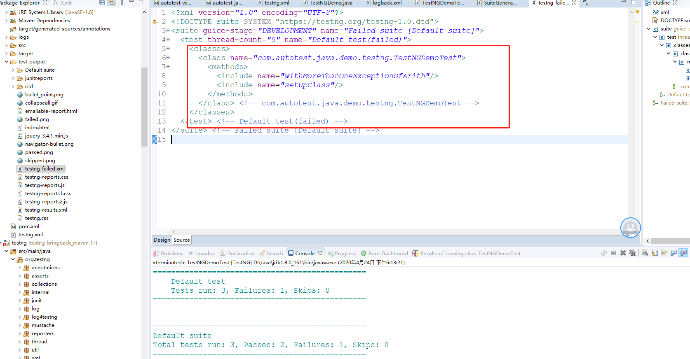
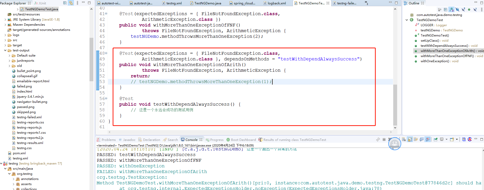
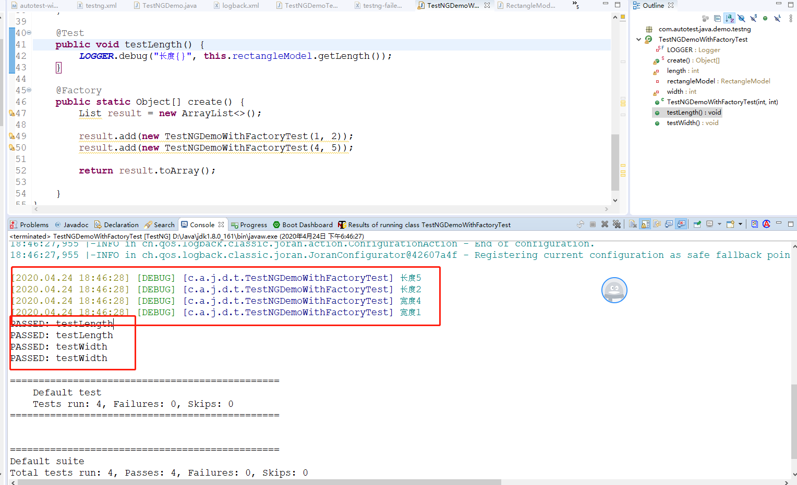
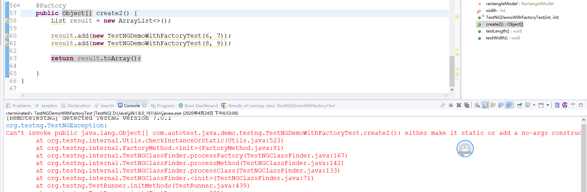
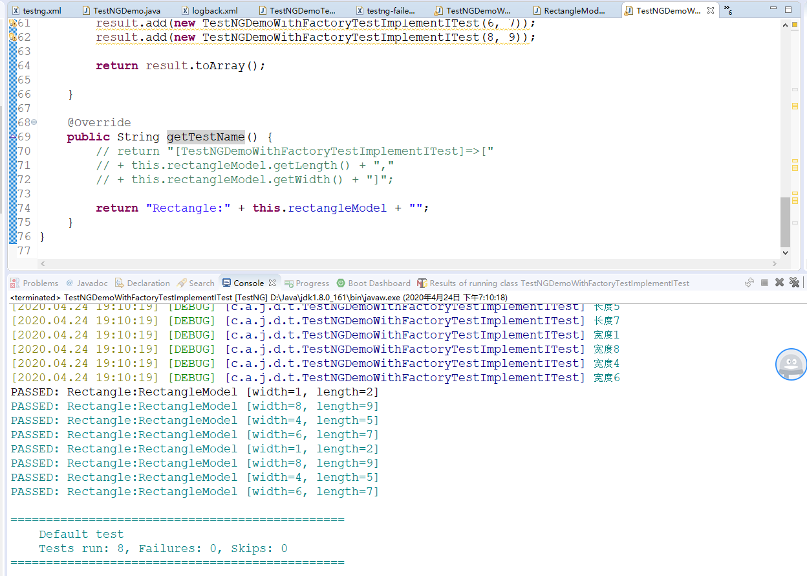
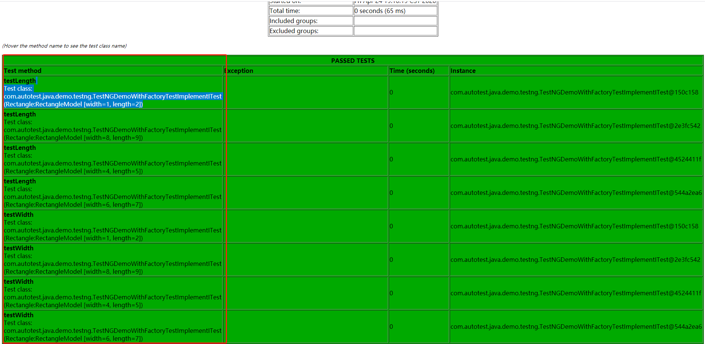

# <center>TestNG学习笔记-测试设计模式</center>

## 一、测试设计模式

### 1.1 针对失败测试

#### 1.1.1 测试代码是否漂亮地处理了失败

原来的junit需要使用try/catch/fail 结构来处理抛出异常的程序，testng只需要在@Test注解中制定希望抛出的异常或者异常列表。

expectedExceptions属性可以是一个异常类，也可以是多个异常类，多个异常类的话直接以类名存一个数组即可，测试方法内部调用之后只要抛出列表中或者指定异常即可测试通过。

如下是两段代码:

```java
public class TestNGDemo{
    public void methodThrowsOneException(int exceptionType)
                throws FileNotFoundException {
            LOGGER.info("这是一个抛出一个异常的方法");
            throw new FileNotFoundException("文件不存在");
    }

    public void methodThrowsMoreThanOneException(int exceptionType)
            throws FileNotFoundException, ArithmeticException {
        LOGGER.info("这是一个抛出多于一个异常的方法");
        switch (exceptionType) {
            case 1:
                LOGGER.debug("文件不存在异常");
                throw new FileNotFoundException("文件不存在");
            case 2:
                LOGGER.debug("算术异常");
                throw new ArithmeticException("算术异常");
            default:
                break;
        }
    }
}

```

如下是对这两段代码的测试方法:

```java
@Test(expectedExceptions = FileNotFoundException.class)
public void withOneException() throws FileNotFoundException {
    testNGDemo.methodThrowsOneException(1);
}

@Test(expectedExceptions = { FileNotFoundException.class,
        ArithmeticException.class })
public void withMoreThanOneExceptionOfFNF()
        throws FileNotFoundException, ArithmeticException {
    testNGDemo.methodThrowsMoreThanOneException(2);
}

```

#### 1.1.2 何时不要用expectedExceptions

测试异常使用expectedExceptions的时候，有些情况最好不要使用这种方式，比如自定义异常，目的是为了增加一些特定的信息给用户，或者记录日志给开发人员观察和分析，那只确保能抛出这些异常还不足够，需要检查特定信息才可以。

这时候需要getMessage来确定返回异常的提示信息，这种情况最好还是用原始的try、catch、fail这种方式，在catch中添加必要的测试。

**另外这种方式，需要考虑国际化，如果你需要的话**

#### 1.1.3 重新执行失败的用例testng-fail.xml

当你想执行包含失败用例的测试套件时，T二十天NG会在输出目录中（默认test-output）下自动生成一个testng-failed.xml的文件，这个文件包含了原来testng.xml中失败的方法构成的子集。

如下图所示的内容，会在该文件中记录一个失败的信息，运行该配置文件，则可以重新运行失败的用例。



此处请注意:执行失败的那些用例，如果它们有依赖的测试，即使这些依赖的测试成功了，这个文件中也会把这些它依赖的但是执行成功的那些用例也包含进来。

如下图所示的代码和执行结果：



它产生的testng-failed.xml如下:

```xml
<?xml version="1.0" encoding="UTF-8"?>
<!DOCTYPE suite SYSTEM "https://testng.org/testng-1.0.dtd">
<suite guice-stage="DEVELOPMENT" name="Failed suite [Default suite]">
  <test thread-count="5" name="Default test(failed)">
    <classes>
      <class name="com.autotest.java.demo.testng.TestNGDemoTest">
        <methods>
          <include name="testWithDependAlwaysSuccess"/>
          <include name="withMoreThanOneExceptionOfArith"/>
          <include name="setUpClass"/>
        </methods>
      </class> <!-- com.autotest.java.demo.testng.TestNGDemoTest -->
    </classes>
  </test> <!-- Default test(failed) -->
</suite> <!-- Failed suite [Default suite] -->
```

如此看来，一个通常的运行测试的流程就是:

```shell
java org.testng.TestNG testng.xml

java org.testng.TestNG test-output/testng-failed.xml

```

### 1.2 工厂

#### 1.2.1 @Factory注解

通常情况下，当我们通过命令行、ant、或者testng.xml将测试类传递给TestNG的时候，TestNG会把所有的类都实例化(通过调用构造方法)，然后执行每个类的测试方法。

这就产生了一个限制，当有些测试类，附带几个成员变量，且需要初始化得时候，问题就来了。

例如代码：

```java
//RectangleModel.java
package com.autotest.java.demo.testng.model;

/**
 * @author : Administrator
 * @since : 2020年4月24日 下午6:31:11
 * @see :此处用一个矩形来测试
 */
public class RectangleModel {
	private int width;
	private int length;

	public int getWidth() {
		return width;
	}

	public void setWidth(int width) {
		this.width = width;
	}

	public int getLength() {
		return length;
	}

	public void setLength(int length) {
		this.length = length;
	}

	@Override
	public String toString() {
		return "RectangleModel [width=" + width + ", length=" + length + "]";
	}

	public RectangleModel(int width, int length) {
		super();
		this.width = width;
		this.length = length;
	}

	public RectangleModel() {
		super();
	}

}

```

下面是依赖于这个矩形类的测试：

```java

//TestNGDemoWithFactoryTest.java
import org.testng.annotations.Test;

import com.autotest.java.demo.testng.model.RectangleModel;

/**
 * @author : Administrator
 * @since : 2020年4月24日 下午6:30:10
 * @see :
 */
public class TestNGDemoWithFactoryTest {
	private RectangleModel rectangleModel;
	private int width;
	private int length;

	public TestNGDemoWithFactoryTest(int width, int length) {
		this.rectangleModel = new RectangleModel();
	}

	@Test
	public void testWidth() {

	}

	@Test
	public void testLength() {

	}
}

```

运行上述测试的时候，则会报错,大致意思是无法初始化这个测试类：

```
[RemoteTestNG] detected TestNG version 7.0.1
org.testng.TestNGException: 
An error occurred while instantiating class com.autotest.java.demo.testng.TestNGDemoWithFactoryTest. Check to make sure it can be instantiated
	at org.testng.internal.InstanceCreator.createInstanceUsingObjectFactory(InstanceCreator.java:134)
	at org.testng.internal.InstanceCreator.createInstance(InstanceCreator.java:79)
	at org.testng.internal.ClassImpl.getDefaultInstance(ClassImpl.java:109)
	at org.testng.internal.ClassImpl.getInstances(ClassImpl.java:167)
	at org.testng.TestClass.getInstances(TestClass.java:102)
	at org.testng.TestClass.initTestClassesAndInstances(TestClass.java:82)
	at org.testng.TestClass.init(TestClass.java:74)
	at org.testng.TestClass.<init>(TestClass.java:39)
	at org.testng.TestRunner.initMethods(TestRunner.java:455)
	at org.testng.TestRunner.init(TestRunner.java:339)
	at org.testng.TestRunner.init(TestRunner.java:292)
	at org.testng.TestRunner.<init>(TestRunner.java:223)
	at org.testng.remote.support.RemoteTestNG6_12$1.newTestRunner(RemoteTestNG6_12.java:33)
	at org.testng.remote.support.RemoteTestNG6_12$DelegatingTestRunnerFactory.newTestRunner(RemoteTestNG6_12.java:66)
	at org.testng.ITestRunnerFactory.newTestRunner(ITestRunnerFactory.java:55)
	at org.testng.SuiteRunner$ProxyTestRunnerFactory.newTestRunner(SuiteRunner.java:676)
	at org.testng.SuiteRunner.init(SuiteRunner.java:178)
	at org.testng.SuiteRunner.<init>(SuiteRunner.java:112)
	at org.testng.TestNG.createSuiteRunner(TestNG.java:1291)
	at org.testng.TestNG.createSuiteRunners(TestNG.java:1278)
	at org.testng.TestNG.runSuitesLocally(TestNG.java:1127)
	at org.testng.TestNG.runSuites(TestNG.java:1066)
	at org.testng.TestNG.run(TestNG.java:1034)
	at org.testng.remote.AbstractRemoteTestNG.run(AbstractRemoteTestNG.java:115)
	at org.testng.remote.RemoteTestNG.initAndRun(RemoteTestNG.java:251)
	at org.testng.remote.RemoteTestNG.main(RemoteTestNG.java:77)

```

解决方法：
可以用@Factory注解,加上如下代码:

```java
//TestNGDemoWithFactoryTest.java
import org.testng.annotations.Factory;

@Factory
	public static Object[] create() {
		List result = new ArrayList<>();

		result.add(new TestNGDemoWithFactoryTest(1, 2));
		result.add(new TestNGDemoWithFactoryTest(4, 5));

		return result.toArray();

	}

```

如图是增加工厂之后的执行结果,可以发现每个测试方法都被执行了两次，因为工厂方法返回了两个实例。



关于工厂的注意点:

- 它需要注解到一个返回对象数组的方法上(返回值是Object[] )
- 它会在所有得Test方法执行之前运行
- 它只会运行一次
- 如果有多个，那么会把所有得@Factory注解的方法执行完之后，再执行测试
- 请把这个方法设置为static，或者把无参构造方法提供出来

如下是如果把这个方法static去掉，则会运行失败:



#### 1.2.2 多个实例的测试信息

在上节中可以看到，运行结果反映的不是那么明显，已经不知道哪个测试用例是由哪个测试类的实例运行的，如果失败了并不方便定位，在报告中出现的也不是很明显。

则可以通过实现ITest接口(org.testng.ITest)来重写getTestName()方法

如下是重写后的测试结果,至于像修改成什么样子来体现的更精细，则需要慢慢斟酌。



如下是在测试报告中的体现:



### 1.3 数据驱动测试(DDT)

由于DDT概念比较大，TestNG中的相关信息也不少，因此另换一篇准们介绍数据驱动。